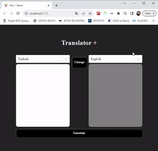

# Translate-App

This project is a translate-app built using @reduxjs/toolkit/react-redux/redux-thunk/react-select

Translation app that supports 100+ languages

## Technologies Used

**React**: A JavaScript library for building user interfaces. It allows for the creation of reusable UI components and facilitates efficient rendering and state management.

**Redux**: A predictable state container for JavaScript applications. Redux helps manage the application's state, enabling easier data flow and state management.

**Redux Toolkit**: An opinionated, batteries-included toolset for efficient Redux development.

**React Redux**: Official React bindings for Redux.

## License

This project is licensed under the MIT License.

## screenRecording

# Translate-App-Redux-Thunk-
